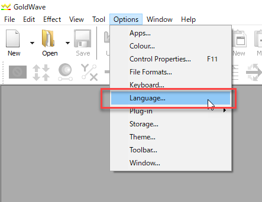
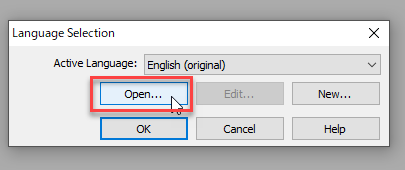
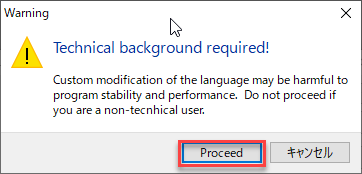
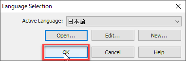
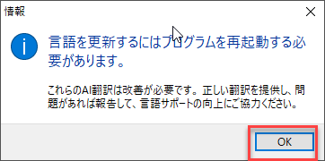
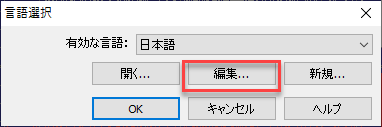
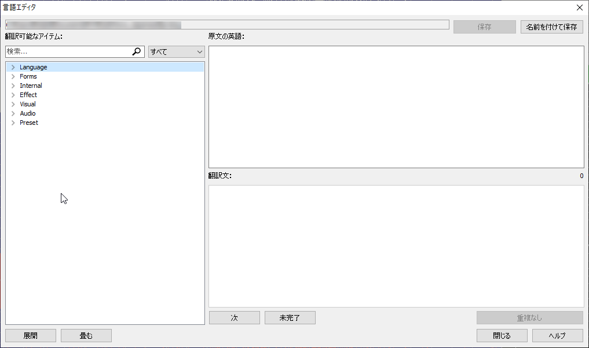

# GoldWave日本語化リソースファイル

このレポジトリには[GoldWave](https://www.goldwave.com/goldwave.php)の日本語UIリソースが含まれています。

現在、GoldWave本体には日本語リソースが含まれているものの、機械翻訳のもので、あまり精度が高くありません。このリソースは翻訳者による翻訳を行っています。

## 使い方

1. GoldWaveを[GoldWave](https://www.goldwave.com/goldwave.php)公式サイトよりダウンロードし、インストールする。
2. レポジトリから[ja.lang](./ja.lang)ファイルをダウンロード。
3. OptionsメニューからLanguage...を選択。

4. 出てきたダイアログでOpen...を選択。

5. ダウンロードしたja.langを選択する。
6. 技術的な背景が必要であるという警告が出てくるのでProceedを押す。

7. Active Languageが日本語となっているのを確認し、OKを押す。

8. 再起動をするように促されるのでOKを押し、ダイアログを閉じてGoldWaveを再起動する。

9. GoldWaveを日本語で使用できるようになりました。

## 翻訳の間違い等が見つかった場合

翻訳の間違いや、より良い訳案が出た場合は是非お知らせください。以下の二通りのどちらかを行っていただければと思います。

1. 本レポジトリの[イシュートラッカー](https://github.com/hsaito/GoldWave_Japanese/issues)でバグ報告として提案していただく。
2. リソースファイルを編集していただいて、プルリクエストとして提案いただく。（Gitが使用できる必要があります。）

以下、上記2の方法について説明します。

1. このレポジトリをフォークし、フォークしたレポジトリのクローンをローカルに作成する。
2. 「使い方」ステップ3のダイアログで「編集...」を選択。

3. エディタが開くので、修正したい項目を探す。（左上の検索機能が便利です。）

4. 更新が完了したら「保存」もしくは「名前を付けて保存」ボタンを押しリソースファイルを保存する。
5. ファイルをコミット後、プルリクエストを出していただく。